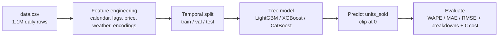
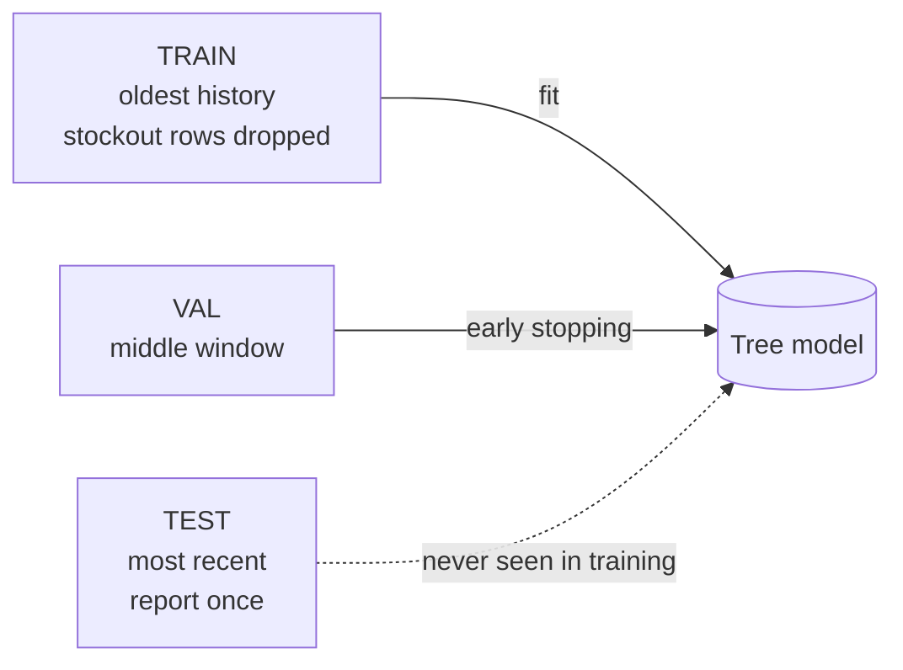
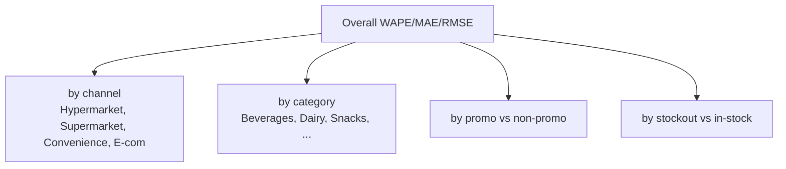

# Classical ML — How the 14-Day Demand Forecast Is Made & Evaluated

A plain-English tour of the Part B baseline: how one tree-based model predicts the
next **14 days** of `units_sold` for **every `(store, sku)` pair**, and how we judge
whether those predictions are any good. Special focus on the metrics and failure
modes in [src/evaluate.py](src/evaluate.py).

---

## 1. The big picture in one sentence

> We turn "forecasting" into an ordinary "predict one number from a row of features"
> problem: **each row = one store × one SKU × one day**, and the model learns to map
> that row's features → that day's `units_sold`.



The whole run is one command:

```bash
uv run python train.py --model lightgbm
```

and it drops a self-contained folder in `artifacts/` (metrics, predictions, model, plots-ready CSVs).

---

## 2. What "predict 14 days ahead" really means here

A naive idea is "predict tomorrow, then feed that prediction back in to predict the
day after, and so on." That **snowballs errors**. We do something cleaner: a
**direct** forecast.

**The trick:** every feature that comes from past demand is shifted by **at least 14
days**. So a single model can forecast *any* day in the 14-day window using only data
that is genuinely available at forecast time.

### Why 14-day shifts make it safe

Imagine today is **T** (the last day we have real sales for). We must forecast
**T+1 … T+14**. Look at what the demand features need:

```
                      forecast window
   ... T-14  ...  T   | T+1  T+2  ...  T+14 |
        │            └──────────────────────┘
        │  lag_14 for target T+14  ── reads day T      ✅ known
        │  lag_14 for target T+1   ── reads day T-13   ✅ known
        └─ every demand lag is ≥14 days back, so nothing
           inside the forecast window is ever read.
```

- `lag_14`, `lag_28` = demand 14 / 28 days ago.
- `rolling_mean_7/14/28`, `rolling_std`, `rolling_min/max` = all **shifted by 14** first,
  so they summarise a window that ends **before** the forecast starts.

This is the **leakage guard**: no feature is allowed to peek into the future it is
trying to predict.

> **Known-future signals are the exception.** Promotions, calendar, and weather are
> *planned or announced in advance*, so the pipeline treats them as known for the
> forecast day (e.g. `promo_flag`, `discount_pct`, holidays). That's a stated
> assumption, not a leak.

---

## 3. What one training row looks like

Think of a single row as a little dossier the model reads before guessing demand:

| Family | Example features | Intuition |
|---|---|---|
| **Calendar** | month, weekday, `is_weekend`, `is_holiday`, `days_since_holiday`, sin/cos cycles | "It's a Saturday in December, near a holiday." |
| **Lag / rolling demand** | `lag_14`, `lag_28`, `rolling_mean_7/14/28`, `rolling_min_7` | "This item usually sells ~40/day lately." |
| **Price / promo** | `effective_price`, `discount_pct`, `price_vs_sku_median`, `days_since_promo` | "It's 20% off — cheaper than its usual price." |
| **Weather** | `temperature`, `rain_mm`, `heavy_rain_flag` | "Cold and rainy → fewer shoppers." |
| **Who/where** | store / sku / channel / category encodings, `series_mean_demand` | "This is a big Hypermarket SKU." |

Two special leakage-aware touches:

- **Censored demand (`demand_adj`).** On a **stockout** day, the shelf was empty, so
  the recorded `units_sold` is *not* real demand — it's just "whatever was in stock."
  Those days are blanked out (`NaN`) before computing lags/rollings, so a stockout
  doesn't teach the model that demand was low.
- **Out-of-fold target encoding.** Category averages (like `series_mean_demand`) are
  computed with K-fold so a row never sees its **own** answer baked into its features.

---

## 4. Training the model



- **Chronological split** (never shuffle time): train = oldest, val = middle,
  test = newest. This mimics reality — we always predict the future from the past.
- **Early stopping on val**: the model keeps adding trees until val error stops
  improving, then stops. Prevents over-fitting.
- **Stockout rows are dropped from training** so the model learns *true* demand, not
  supply-capped sales.
- **Predictions are clipped at 0** — you can't sell negative units.

> 💡 **Why train "all rows" and "in-stock" metrics are identical.** Because training
> already removed every stockout row, the train set is *100% in-stock*. So the two
> views describe the same rows. This is expected, not a bug — you only see them differ
> on val/test, which keep stockout days.

---

## 5. Evaluation — the heart of it

After training we predict on val and test, then score with
[src/evaluate.py](src/evaluate.py). Everything below is computed there.

### 5.1 The three core metrics (with a worked example)

Say for one segment the actuals and predictions are:

| day | actual `y` | pred `ŷ` | error `ŷ−y` | \|error\| | error² |
|---:|---:|---:|---:|---:|---:|
| 1 | 10 | 12 | +2 | 2 | 4 |
| 2 | 20 | 15 | −5 | 5 | 25 |
| 3 | 0  | 3  | +3 | 3 | 9 |
| 4 | 30 | 31 | +1 | 1 | 1 |
| **Σ** | **60** | | **+1** | **11** | **39** |

$$
\textbf{MAE} = \frac{\sum|y-\hat{y}|}{n} = \frac{11}{4} = 2.75
\qquad
\textbf{RMSE} = \sqrt{\frac{\sum (y-\hat{y})^2}{n}} = \sqrt{\frac{39}{4}} \approx 3.12
$$

$$
\textbf{WAPE} = \frac{\sum|y-\hat{y}|}{\sum|y|} = \frac{11}{60} \approx 0.183 \;(18.3\%)
\qquad
\textbf{bias} = \frac{\sum(\hat{y}-y)}{n} = \frac{+1}{4} = +0.25
$$

What each one *tells you*, in plain words:

| Metric | Reads as | Sensitive to | Good for |
|---|---|---|---|
| **MAE** | "typically off by ~2.75 units" | all errors equally | easy to explain |
| **RMSE** | "off by ~3.1, big misses hurt more" | **big** errors (squared) | catching spikes |
| **WAPE** | "off by ~18% of total volume" | scale-free % | **comparing** SKUs/stores of different sizes |
| **bias** | "+ = over-forecast on average" | direction | spotting systematic lean |

```
MAE  vs  RMSE  intuition
                     one big miss
 errors: 2 2 2 2      errors: 0 0 0 8
 MAE  = 2.0           MAE  = 2.0     ← same
 RMSE = 2.0           RMSE = 4.0     ← RMSE screams "a spike hurt"
```

> **Why WAPE is the headline.** A Hypermarket SKU selling 500/day and a Convenience
> SKU selling 5/day can't be compared with raw MAE. WAPE divides by volume, so both
> are on a "% of demand" scale. That's why almost every breakdown reports WAPE first.

### 5.2 Breakdowns — *where* the error lives

The same metrics, sliced by group, so you can see *who* is hard to forecast:



These are written as `breakdown_{channel,category,promo,stockout}_test.csv` for quick
eyeballing.

### 5.3 The two "views": all rows vs in-stock

This is the subtle, important one.

```
Stockout day:  true demand = 100, but only 60 units were in stock.
               recorded units_sold = 60  (capped!)
               model predicts       = ~100  (correct true demand)
               → looks like a +40 "over-forecast" — but the model was RIGHT.
```

So `evaluate.py` reports **two overalls**:

- **`overall` (all rows)** — includes stockout days. Honest about operational reality,
  but *unfairly* penalises correct demand forecasts on empty-shelf days.
- **`overall_ex_stockout` (in-stock only)** — removes those censored days. This is the
  **fair** read of forecast quality.

And `by_stockout` shows the two side by side. In our run the stockout rows carry a huge
positive `bias` (~+50) — exactly the "empty shelf" artifact, not a model failure.

### 5.4 Business proxy — turning errors into euros

Metrics are nice, but leadership thinks in money. `business_proxy` converts every
forecast error into a cost, depending on its **direction**:

```
   under-forecast (ŷ < y)                 over-forecast (ŷ > y)
   → you understocked                     → you overstocked
   → lost sales                           → capital tied up in inventory
   cost = missed units × unit margin      cost = extra units × purchase_cost
          (list_price × margin_pct)
```

$$
\text{total business cost} = \underbrace{\sum \max(\hat{y}-y,0)\cdot \text{purchase\_cost}}_{\text{overstock}}
\;+\; \underbrace{\sum \max(y-\hat{y},0)\cdot (\text{list\_price}\times\text{margin\_pct})}_{\text{lost margin}}
$$

This tells you **which mistake direction is more expensive** — often the tie-breaker
when choosing which model to ship.

---

## 6. Failure modes — where the baseline struggles

The notebook ([notebooks/artifact_exploration.ipynb](notebooks/artifact_exploration.ipynb))
visualises these; here's the intuition.

| Failure mode | What you see | Why it happens |
|---|---|---|
| **Promo spikes** | promo rows: high MAE, model **under-shoots** | rare, explosive demand jumps are hard to fully predict |
| **Sparse / low-volume SKUs** | worst per-series WAPE, noisy | few sales → tiny denominator, every miss is a big % |
| **Cold starts** | new store/SKU with little history | lag/rolling features are empty, so the model leans on averages |
| **Stockout censoring** | stockout rows: large positive bias | actuals are capped below true demand (Section 5.3) |
| **Drift** | error creeping up over the test window | tastes/prices shift away from what training saw |

```
Promo spike the model can't fully catch:

 units   ▲                      *  ← actual promo spike (120)
         │                     ╱ ╲
         │        ● ● ● ● ●   ╱   ● ← prediction lags the jump (~80)
         │  ● ● ●          ╲ ╱
         └───────────────────────────►  time
                              ▲ promo day
```

**Diagnosing them is easy from the artifacts:**
`predictions_test.parquet` carries every row's `y_pred`, `error`, `abs_error`, plus
context (`promo_flag`, `stock_out_flag`, `store_id`, `sku_id`, `category`, …), so you
can group and rank misses any way you like.

---

## 7. TL;DR

1. **Frame**: one row = store × sku × day; predict that day's `units_sold`.
2. **Forecast 14 days directly** by lagging all demand features ≥14 days — no future
   leaks, no error snowball.
3. **Train** on the oldest data (stockouts dropped), early-stop on the middle window,
   report once on the newest window.
4. **Score** with WAPE (headline, scale-free), MAE (plain), RMSE (punishes spikes),
   bias (direction) — overall, sliced by segment, and in € cost.
5. **Read the in-stock view** for true forecast quality; watch promo spikes, sparse
   SKUs, cold starts, and drift as the known weak spots.
