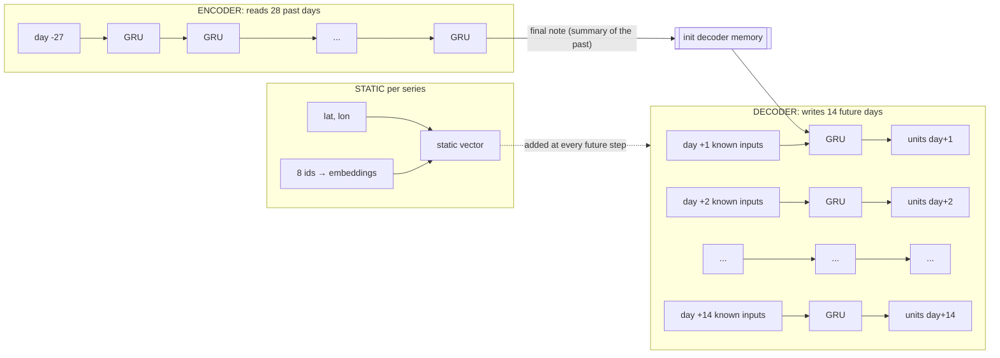

# Deep Learning — GRU Encoder-Decoder: Training & Evaluation

Dense reference for the Part C model: architecture, training recipe, config, how the
dataset is windowed in [src/dl_dataset.py](src/dl_dataset.py), how the scripts fit
together, and why the **same** [src/evaluate.py](src/evaluate.py) scores it. Pairs with
the classical write-up in
[classical-model-training-and-evaluation.md](classical-model-training-and-evaluation.md).

---

## 0. One-line mental model

> **Read 28 past days → predict the next 14**, for every `(store, sku)`, with **one
> global network** whose weights are shared across all ~1,005 series.


---

## 1. Architecture ([src/dl_model.py](src/dl_model.py))

Before the full picture, let's build it up from the smallest piece: the GRU cell.

### 1.0 What is a GRU? — a smart note-taker

A **GRU (Gated Recurrent Unit)** reads a sequence **one step at a time** and keeps a
running summary of everything it has seen so far. Think of a person reading a sales diary
day by day, holding a mental note ("this SKU has been selling ~40/day, ticking up before
the weekend"). That mental note is the **hidden state** `h` — a vector of numbers.

At each new day the GRU updates its note using two **gates** (little valves, each a number
between 0 and 1 that says "how much"):

```
        past note h(t-1)          today's inputs x(t)
                │                        │
                ▼                        ▼
        ┌───────────────── GRU cell ─────────────────┐
        │  reset gate  r  = "how much of my old note  │
        │                    is relevant to read      │
        │                    today's numbers?"        │
        │                                             │
        │  candidate   ñ  = a fresh note proposed     │
        │                    from today + (r · old)   │
        │                                             │
        │  update gate z  = "how much do I replace    │
        │                    my old note with ñ?"     │
        │                                             │
        │  new note  h(t) = blend(old note, ñ)  by z  │
        └─────────────────────────────────────────────┘
                          │
                          ▼
                   new note h(t)  ──►  carried to the next day
```

- **Reset gate `r`** — when small, the cell *forgets* the old note while forming today's
  candidate (useful right after a promo ends, when the recent past stops being relevant).
- **Update gate `z`** — decides the blend: keep the old note (`z→` keep) or overwrite it
  with the fresh candidate (`z→` replace). This is what lets a GRU **remember things for a
  long time** (weekly/monthly rhythm) without the signal fading — it simply chooses not to
  overwrite.

That's the whole magic: two gates that learn *what to forget* and *what to keep*, so the
running note captures the series' recent behaviour.

### 1.1 `hidden_size` and `num_layers` — the note's size and depth

- **`hidden_size` (=64)** is the **length of that note vector** — how many numbers the GRU
  uses to summarise the situation. Bigger = more things it can remember at once (weekday
  pattern, trend, promo after-effects…), at the cost of more parameters/compute. 64 is a
  modest, fast choice.
- **`num_layers` (=2)** **stacks two GRUs**: the first reads the raw days and produces a
  note each step; the second reads *those notes* and produces a higher-level note. Layer 1
  learns "what happened", layer 2 learns "what it means". More layers = more abstraction.

### 1.2 Reading a sequence (the GRU "unrolled")

Running the same cell across the 28 days looks like a chain, the note passed along:

```
 day:   d1      d2      d3     ...     d28
        x1      x2      x3             x28
        │       │       │              │
  h0 ─► GRU ─► GRU ─► GRU ─► … ─────► GRU ─► h28  ("recent situation" summary)
        │       │       │              │
        (same weights reused at every step)
```

It's **one small cell reused 28 times**, not 28 different networks — that weight-sharing is
why it handles sequences of any length with few parameters.

### 1.3 Our encoder–decoder

We use **two** GRUs. The **encoder** digests the past; the **decoder** writes the future.



- **Encoder GRU** — walks the 28 past days and boils them into one **final note** (the
  hidden state). This note *is* the model's understanding of "where this series stands now."
- **Hand-off** — that final note becomes the decoder's **starting memory**, so the decoder
  begins already knowing the recent situation.
- **Decoder GRU** — walks the 14 future days. At each future day it reads the
  **known-ahead inputs** for that day (promo? holiday? price? weather?) plus the **static
  vector** (which store/SKU this is), updates its note, and a **Linear head** turns the note
  into one number: predicted `units_sold` for that day. All 14 come out in one pass
  (**direct** multi-horizon — no feeding guesses back in, so no error snowball).

### 1.4 What the model actually reads at each step (the "input widths", unpacked)

A GRU step consumes a **feature vector** (a flat list of numbers). The confusing line just
counts how long each vector is. Concretely:

**Encoder — one vector per past day (length 15):**

| Slot | Numbers | What it is |
|---|---:|---|
| demand history | 1 | scaled `log1p` demand that day (censored days blanked) |
| stockout flag | 1 | was it a stockout that day? |
| known signals | 13 | calendar sin/cos (6) + `is_weekend`, `is_holiday`, `promo_flag`, `discount_pct`, `list_price`, `temperature`, `rain_mm` |
| **total** | **15** | → fed to the encoder GRU, ×28 days |

**Decoder — one vector per future day (length 13):**

| Slot | Numbers | What it is |
|---|---:|---|
| known signals | 13 | the **same** known-ahead signals, but for the forecast day |
| — | — | *(no demand/stockout here — the future target is unknown)* |

The decoder also gets the **static vector** appended at every step (see below).

**Static — one vector per series (length 130 → squeezed to 64):**

| Slot | Numbers | What it is |
|---|---:|---|
| 8 embeddings | 8 × 16 = 128 | store, sku, channel, category, subcategory, brand, country, city — each id turned into a learned 16-number vector |
| geo | 2 | latitude, longitude (scaled) |
| **total** | **130** | → a small `Linear+ReLU` compresses it to `hidden_size=64` |

So "`8×16 + 2 = 130 → projected to hidden_size`" just means: *stack the 8 embedding vectors
(16 numbers each) with lat/long (2 numbers), then a tiny layer shrinks that 130-long vector
to a tidy 64-long "who am I" vector* that flavours every decoder step.

### 1.5 Quick glossary (the knobs that confused you)

| Term | Plain meaning | Picture |
|---|---|---|
| **hidden_size (64)** | length of the GRU's running-note vector = memory capacity | a 64-slot notepad |
| **num_layers (2)** | GRUs stacked; layer 2 reads layer 1's notes | "what happened" → "what it means" |
| **embedding_dim (16)** | each category id becomes a learned 16-number vector | store #7 → `[0.2, -1.1, …]` (16 numbers) |
| **encoder_len (28)** | how many past days the encoder reads | the 28-day look-back window |
| **train_stride (3)** | when making training windows, take **every 3rd** origin day | see below |

**`train_stride`, visualised.** Every day could be a forecast "origin" (a *today*), and
consecutive windows overlap almost entirely — window starting today vs. tomorrow share 27 of
28 encoder days and 13 of 14 targets. That's hugely redundant, so for **training** we skip
ahead by `train_stride` days between windows to cut the sample count (and epoch time) with
little information loss:

```
origins:  ● . . ● . . ● . . ● . . ●      stride = 3  → keep 1, skip 2
          ↑     ↑     ↑                   (validation/test instead TILE every 14
       window window window                 days so each day is scored exactly once)
```

### 1.6 Network summary (shapes & parameters)

A `torchsummary`-style dump of the real model (batch `B=2`, `L=28` past days, `H=14`
horizon; embedding cardinalities are the train uniques + 1 for unseen):

> **Careful — the two `2`s are different things.** In every `Output Shape` below, the
> **leading `2` is `B` = the batch size** (how many windows we pushed through *at once*, just
> to print this table — it could be 1 or 512). It is **not** the number of layers. The model's
> **two abstraction layers** come from `num_layers=2` and live *inside* the GRUs — notice the
> layer count doesn't even appear in the output shape (a stacked GRU only returns its top
> layer's output). See §1.7 for what those two layers actually do.

```
----------------------------------------------------------------
Layer (type)                  Output Shape             Param #
================================================================
Embedding[0] store_id         [2, 16]                      224
Embedding[1] sku_id           [2, 16]                    1,648
Embedding[2] channel          [2, 16]                       80
Embedding[3] category         [2, 16]                       96
Embedding[4] subcategory      [2, 16]                      288
Embedding[5] brand            [2, 16]                      112
Embedding[6] country          [2, 16]                      128
Embedding[7] city             [2, 16]                      160
static_mlp (Linear+ReLU+Drop) [2, 64]                    8,384   # (130→64)
encoder GRU (2 layers)        [2, 28, 64]               40,512
decoder GRU (2 layers)        [2, 14, 64]               52,416
head Linear                   [2, 14, 1]                    65
================================================================
Total params: 104,113
Trainable params: 104,113
Non-trainable params: 0
----------------------------------------------------------------
Params size (MB): 0.40
Final output: [2, 14]   (14 daily units per series in one pass)
----------------------------------------------------------------
```

**How to read it:**

- **Output shapes** trace the data flow: 8 ids → `[B,16]` embeddings; static block → `[B,64]`;
  encoder reads 28 steps → `[B,28,64]` (a 64-note summary per step); decoder writes 14 steps
  → `[B,14,64]`; head squeezes each to 1 number → **`[B,14]`** = the 14-day forecast.
- **Why the GRUs dominate the params.** A GRU has **3 gates**, so it holds ~3× the weights of
  a plain layer:  `3 × (hidden·(input+hidden) + biases)`. Encoder = `3·(64·(15+64)+…) ≈ 40.5K`;
  the decoder is a touch larger because its per-step input is wider (`13 known + 64 static = 77`).
- **Featherweight by design.** At **104K params / 0.40 MB**, this model is ~**1,300× smaller**
  than the VGG-16 reference (138M params / 528 MB). Demand forecasting needs *memory of a
  sequence*, not the millions of pattern detectors an image net needs — which is exactly why
  it trains on a CPU in minutes and would serve cheaply.

Reproduce it anytime:

```python
import torch
from src.dl_model import GRUEncoderDecoder

cards = [14, 103, 5, 6, 18, 7, 8, 10]  # per static categorical (train uniques + 1)
m = GRUEncoderDecoder(cards, n_enc_feat=15, n_fut_feat=13, n_stat_num=2,
                      hidden_size=64, num_layers=2, dropout=0.1, embedding_dim=16)
print(sum(p.numel() for p in m.parameters()), "params")
```

### 1.7 Visualizing the 2 stacked layers (`num_layers=2`)

`num_layers=2` stacks **two GRUs on top of each other**. The data moves in **two
directions at once** — sideways through time, and upward through abstraction:

```
                 abstraction ↑  (num_layers = 2 stacked GRUs)

  LAYER 2   h2₀→[GRU2]→[GRU2]→[GRU2]→ … →[GRU2]→ h2₂₈   ← "what it MEANS"
                 ▲       ▲       ▲            ▲            (trend, fading promo bump)
                 │       │       │            │
  LAYER 1   h1₀→[GRU1]→[GRU1]→[GRU1]→ … →[GRU1]→ h1₂₈   ← "what HAPPENED"
                 ▲       ▲       ▲            ▲            (reads the raw daily numbers)
                 │       │       │            │
  INPUT         x₁      x₂      x₃          x₂₈           ← the 15-number vector per day
                day-27  day-26  day-25      day 0 (T)

              └────────── time (28 encoder days) ───────┘
```

- **→ sideways = memory across time.** Each layer passes its running note from one day to the
  next (that's the recurrence).
- **↑ upward = abstraction across layers.** Layer 1 reads the **raw** 15-number daily vectors
  and emits a note each day. Layer 2 reads **Layer 1's notes** (never the raw data) and forms
  a higher-level note.
- The **decoder** is the same 2-layer stack, just unrolled over the **14 future** days.

**Analogy.** Layer 1 is a junior analyst scribbling "sold 40 today, 38 yesterday…"; Layer 2
is a senior reading the junior's notes and concluding "steady uptrend, promo bump fading."
Two layers = two levels of interpretation.

**Two knobs, two axes:**

| Knob | Axis | Meaning |
|---|---|---|
| `hidden_size=64` | **width** of each note | how *much* it can remember (64 numbers) |
| `num_layers=2` | **height** of the stack | how *abstract* the reasoning gets (2 levels) |

---

## 2. How the dataset is built ([src/dl_dataset.py](src/dl_dataset.py))

The classical model wants a *flat table with pre-baked lags*. The GRU wants the **raw
sequence** and learns the lags itself. So we reshape, splitting every column into three
**roles**:

| Role | Columns | Fed to | Known in the future? |
|---|---|---|---|
| **static** | store/sku/channel/category/subcat/brand/country/city + lat/long | both (as a vector) | constant |
| **known-future** | calendar sin/cos, `is_weekend`, `is_holiday`, `promo_flag`, `discount_pct`, `list_price`, `temperature`, `rain_mm` | encoder **and** decoder | ✅ yes |
| **observed** | scaled demand history + `stock_out_flag` | encoder only | ❌ past only |

**Windowing** (the flashcard):

```
 series timeline ───────────────────────────────────────────►
   [ ---- 28 past days ---- ][ ---- 14 target days ---- ]
   encoder inputs             decoder known inputs + labels
                         ▲ origin T
   slide the window along the series to make many samples
```

Build steps, in order:

1. **Calendar cyclic** features added (`month_sin/cos`, `weekday_*`, `weekofyear_*`).
2. **Fit transforms on TRAIN only** — `StandardScaler` for known + static numerics; target
   stats `μ, σ` of `log1p(units_sold)` on **in-stock** train rows; categorical vocabularies
   (index `0` reserved for unseen).
3. **Transform whole frame** — known/static scaled; target history = `log1p(demand_adj)`
   (stockout → NaN → filled with train mean) then standardised; labels = scaled
   `log1p(units_sold)`.
4. **Loss mask** = `1 − stock_out_flag` (stockout target days excluded from the loss).
5. **Per-series arrays + windows** — for each origin `T`, emit a sample if the whole
   `[T+1 … T+14]` target window lands inside one split.

**Split-safe sampling** (leakage + fair benchmark):

| Split | Origin selection | Why |
|---|---|---|
| train | every `train_stride=3`rd origin | plenty of samples, cheaper epochs |
| val / test | **tile every 14 days** (`[::H]`) | each day scored **once**, like the baseline |

`log1p` compresses spiky counts (a 300-unit promo day doesn't dominate the loss); we invert
with `expm1` before any metric so numbers are real units.

---

## 3. Training recipe ([src/dl_pipeline.py](src/dl_pipeline.py))

| Ingredient | Choice | Why |
|---|---|---|
| **Loss** | masked **Huber** (`smooth_l1`) in log-space | robust to spikes (L2 near 0, L1 in the tail); mask skips stockout days |
| **Optimizer** | **Adam**, `lr=1e-3` | strong default for RNNs |
| **Batch size** | **512** | throughput vs. gradient noise balance on CPU |
| **Grad clip** | norm **1.0** | stops RNN gradient explosions |
| **Epochs / patience** | up to **40**, stop after **6** stale | avoid over-fitting, save time |
| **Early-stop metric** | **real val WAPE (in-stock)** via `evaluate_split` | optimise the *reported* metric, not the training loss |
| **Shuffle** | shuffle **windows** (not time within a window) | independent samples; still time-safe |

```
train loop ─ each epoch:
  for batch in TRAIN (shuffled windows):
     pred = model(...); loss = masked_huber(pred, y, mask); step
  val_wape = evaluate_split(reshape(predict(VAL)))["in_stock"]["wape"]
  keep best; stop if no improvement for `patience` epochs
```

Why early-stop on the reshaped WAPE and not the loss? The loss lives in scaled log-space
with masking — a *different quantity* than the headline metric. Selecting on the true WAPE
guarantees the checkpoint we ship is the one that wins on the number we report.

---

## 4. Config knobs ([configs/baseline.yaml](configs/baseline.yaml) → `dl:`)

| Param | Value | Effect |
|---|---|---|
| `encoder_len` | 28 | history length read (weekly + monthly rhythm) |
| `horizon` | 14 | fixed forecast length (assignment constraint) |
| `train_stride` | 3 | 1-in-3 origins → ~231k train windows; raise to speed up |
| `hidden_size` | 64 | GRU capacity |
| `num_layers` | 2 | stacked GRU depth (enables intra-GRU dropout) |
| `dropout` | 0.1 | regularisation |
| `embedding_dim` | 16 | width of each categorical embedding |
| `batch_size` | 512 | samples per step |
| `lr` | 0.001 | Adam step size |
| `max_epochs` / `patience` | 40 / 6 | training budget + early-stop |
| `grad_clip` | 1.0 | gradient-norm cap |

---

## 5. How the scripts fit together

```
train_dl.py  ── CLI (--max-epochs, --limit-series for smoke tests)
     │
     ▼
src/dl_pipeline.run()
     ├─ data.load_data            (shared with classical)
     ├─ dl_dataset.build_dl_data  → DLData (series arrays, samples, scalers, dims)
     ├─ WindowDataset ×3          (train/val/test) → DataLoader
     ├─ dl_model.GRUEncoderDecoder
     ├─ train loop + early stop (on val WAPE)
     ├─ _predict → _to_units → _evaluate  (train/val/test)
     └─ write artifacts  ── SAME folder shape as the tree baseline
```

**Artifacts** (identical shape to Part B, so the exploration notebook & comparison tooling
just work): `metrics.json` (train/val/test), `metrics_summary.txt`, `run_meta.json`,
`predictions_{test,val}.parquet`, `breakdown_{channel,category,promo,stockout,horizon}_test.csv`,
`config.yaml`, `model.pt`.

---

## 6. One evaluator, two model families

The trick that makes the comparison **apples-to-apples**: the GRU produces a `(sample, 14)`
matrix, but `evaluate.py` expects one row per `(store, sku, date)`. We bridge them:

```
GRU preds [n,14] ──expm1──► units ──flatten──► long[store,sku,date,horizon,y_pred]
                                                        │ merge on (store,sku,date)
                                                        ▼
                               df context (units_sold, promo, channel, cost, …)
                                                        │
                                                        ▼
                               evaluate_split(...)  ← the SAME function the tree uses
```

Because both models funnel into `evaluate_split`, they share **identical metric
definitions, breakdowns, in-stock view, and business proxy** on the **same test dates**.
A `horizon` column rides along, auto-enabling the extra `by_horizon` breakdown for the DL
side only.

---

## 7. Results snapshot (`gru_v1`, 40-epoch budget, best epoch 13, CPU)

| test metric (in-stock) | LightGBM | GRU | winner |
|---|---|---|---|
| **WAPE** | 0.2407 | **0.2437** | tree (by a hair) |
| MAE / RMSE | 14.77 / 22.12 | 14.86 / 22.30 | ~tie |
| bias | −0.05 | −2.72 | tree (better centred) |
| train time | seconds | ~16 min (CPU) | tree |

- **Generalisation is clean:** train / val / test in-stock WAPE = 0.241 / 0.244 / 0.244 — a
  flat line, no over-fit.
- **Per-horizon WAPE is nearly flat (~0.26)** across lead times 1→14 — the direct head
  holds accuracy out to day 14 rather than decaying.

```
per-horizon WAPE (test)     ~0.26 everywhere
 0.28 │        ·        ·
 0.26 │  · · ·   · · · ·   · · ·      ← no decay across the 14-day window
 0.24 │
      └───────────────────────────►  h=1 … h=14
```

**Read-out:** the GRU **matches** a well-tuned tree but costs far more to train/serve and
carries a small negative bias → **ship LightGBM v1, keep the GRU as v2** (its shared-weight
representation and known-future decoder pay off as data / promo complexity grows). Detailed
side-by-side lives in the comparison notebook.

---

## 8. TL;DR

1. **Window** each series into `28 past → 14 future` flashcards; roles = static /
   known-future / observed.
2. **One global GRU enc-dec**, shared weights, embeddings for ids, direct 14-step head.
3. **Train** with masked Huber + Adam, early-stop on the **real val WAPE**; scalers/vocabs
   fit on train only; stockout days masked.
4. **Same `evaluate_split`** scores both models on the same test days → honest comparison
   with a bonus per-horizon view.
5. **Result:** GRU ≈ tree on accuracy, pricier to run → tree first, GRU as the growth bet.
